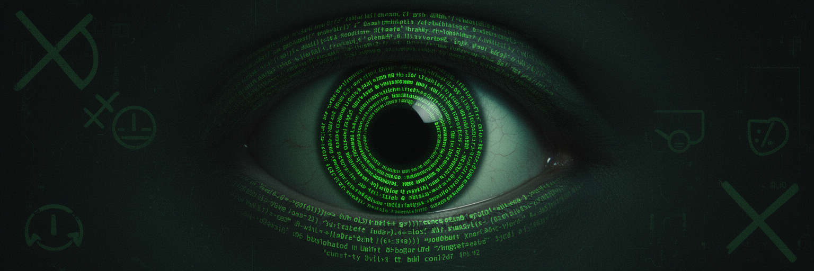

<p align="center">
  
</p>

# eyes-wide-open

> **Legacy repository:** The maintained NVIDIA freeze diagnostic and narrow
> D3cold mitigation now live in
> [`linux-idle-freeze-guard`](https://github.com/olympus-terminal/linux-idle-freeze-guard).
> This repository is retained for historical scripts and migration reference.

Several scripts here disable suspend, screen locking, or other power-management
controls. Those changes can affect physical security, battery use, thermals, and
data integrity. Review each script and its rollback path before running it; do
not apply the broad or "nuclear" variants as a generic first step.

This repository collects earlier Linux power-management and display-recovery
experiments together with unrelated Android and storage utilities.

## What's Here

### Linux: Anti-Suspend / Anti-Sleep

Prevents Linux workstations from suspending during long-running jobs — covers all 7 layers that can independently put a machine to sleep (systemd, logind, GNOME, GDM, NVIDIA services, NVIDIA driver, screen blanking).

| Script | What It Does |
|--------|-------------|
| `disable-sleep.sh` | Comprehensive anti-suspend — disables all known sleep paths |
| `kill-all-sleep.sh` | Nuclear option — aggressive standalone version that kills every sleep mechanism |
| `fix-sleep-permanently.sh` | Persistent fix for display freeze / black screen after suspend |
| `diagnose.sh` | Top-level diagnostic for suspend and sleep issues |
| `verify.sh` | Verification checklist — confirms all fixes are active |

### Linux: HDMI EDID Compositor Freeze

NVIDIA HDMI connections can suffer intermittent EDID read failures that wedge the compositor (desktop freezes, cursor still moves). Full writeup in [`docs/hdmi-edid-compositor-freeze.md`](docs/hdmi-edid-compositor-freeze.md).

| Script | What It Does |
|--------|-------------|
| `scripts/fix-hdmi-edid.sh` | Captures a static EDID and configures the NVIDIA driver to skip monitor polling |

### Linux: Idle Freeze Guard (`scripts/`)

Targeted at NVIDIA GPU systems where idle causes display freezes (Xid 119/120 GSP firmware crashes).

| Script | What It Does |
|--------|-------------|
| `scripts/diagnose.sh` | Checks system for conditions that cause display freezes |
| `scripts/fix.sh` | Disables all idle suspend/sleep/screen blanking at every stack level |
| `scripts/recover.sh` | Recovery from a frozen display (run from TTY) |
| `scripts/install-monitor.sh` | Installs a systemd timer that re-checks after package upgrades |
| `scripts/uninstall.sh` | Removes all fixes, monitors, and hooks |

### Android: Safe Volume Disablement

Disables the automatic volume reduction and "hearing safety" nag on Android/MagicOS devices via ADB.

| Script | What It Does |
|--------|-------------|
| `disable-safe-volume.sh` | Kills safe volume enforcement for speaker, Bluetooth, and wired outputs |

Requires USB debugging enabled and an authorized ADB connection. See the script for details on which settings it modifies.

### USB: JMS567 SATA Controller Recovery

The JMicron JMS567 USB-to-SATA bridge has a firmware bug that reports corrupted capacities (e.g., 115.5P instead of 22TB). Documented fixes include slot-swapping, USB storage quirks, exFAT boot sector repair via TestDisk, and direct SATA connection as a last resort. Full guide is in the commit history (`e732c4f`).

### Utilities

| Script | What It Does |
|--------|-------------|
| `find_content_duplications` | Finds duplicate files by partial MD5 hash (useful for large storage cleanup) |

## Quick Start

For current NVIDIA idle-freeze diagnosis, start with the maintained successor:

```bash
git clone https://github.com/olympus-terminal/linux-idle-freeze-guard.git
cd linux-idle-freeze-guard
./scripts/diagnose.sh
```

If you need one of the historical utilities in this repository, clone it and
inspect the relevant script before execution:

```bash
git clone https://github.com/olympus-terminal/eyes-wide-open.git
cd eyes-wide-open

# Android safe volume (connect phone via USB first)
./disable-safe-volume.sh

# Verify Linux fixes are active
./verify.sh
```

## License

MIT
